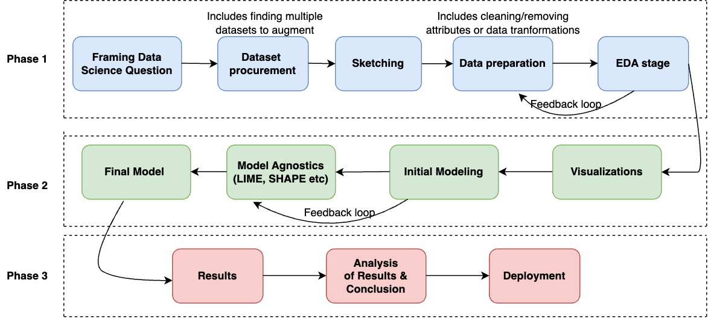
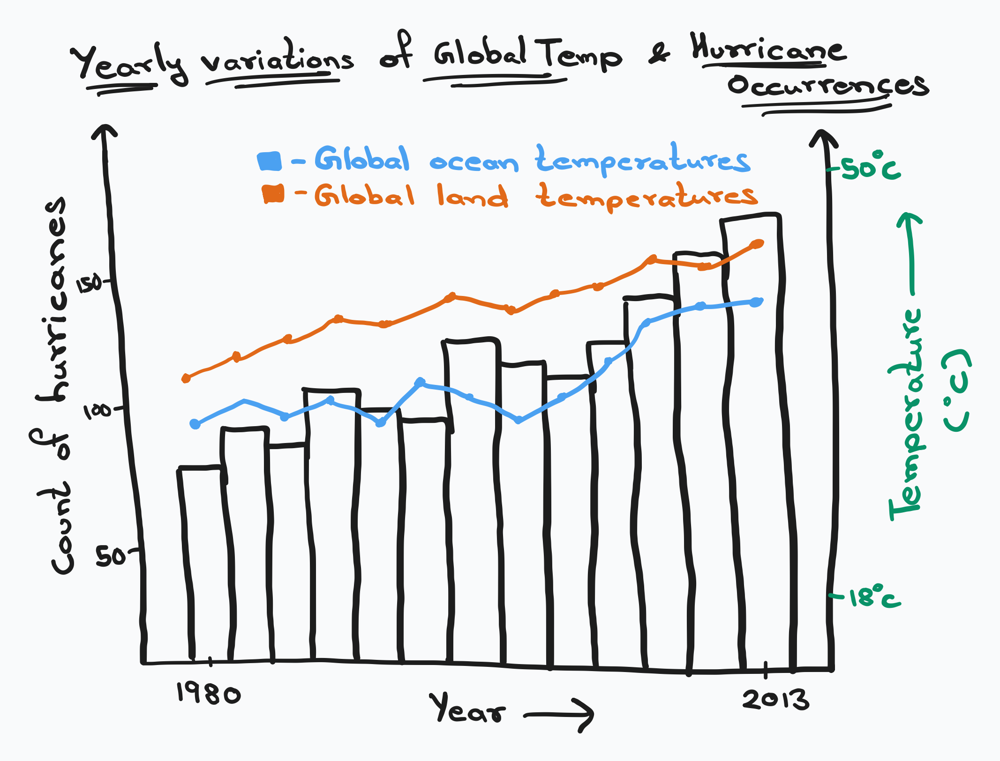
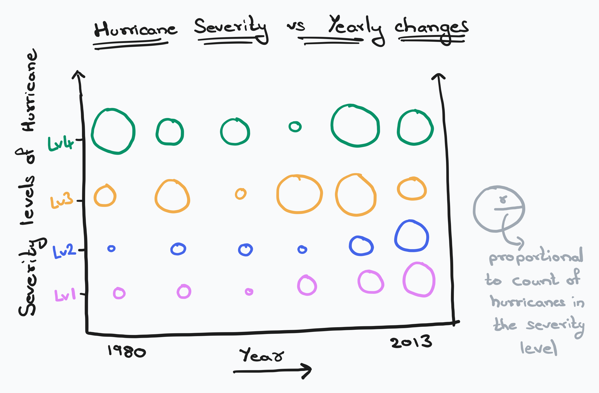

# Final Project Proposal

**GitHub Repo URL**: [final-project-f24-indusinnovators](https://github.com/CMU-IDS-Fall-2024/final-project-f24-indusinnovators/)

## Data Science Question
**How is climate change shaping the intensity and frequency of hurricanes, and what emerging insights can we uncover about future hurricane patterns?**

In this question, we explore the growing influence of climate change on the dynamics of hurricanes. Specifically, how can we analyze the impact of rising surface temperatures on the severity and frequency of these storms? Ultimately, this data science project hopes to provide insights that help guide policymakers on strategies that can save lives, reduce economic losses, and foster greater sustainability commitments towards the future.

## Data Description
**Hurricane Dataset:**  
We make use of the [**IbTrACS**](https://www.ncei.noaa.gov/products/international-best-track-archive) database for this project. This is a global dataset of hurricanes, tropical storms, and cyclones; in particular, we focus on storms recorded after 1980. The dataset has dozens of columns to accommodate differences in recording across countries; some relevant fields we consider are the subbasin the storm formed in, the time of recording, latitude and longitude of the storm, wind speed and pressure, and hurricane category.

We will augment this dataset with global temperature data  from: [**Global Temperatures Dataset**](https://www.kaggle.com/datasets/berkeleyearth/climate-change-earth-surface-temperature-data/data), a compilation of average temperatures across a country seen every day since 1750. It has been put together by the **Berkeley Earth**, which is affiliated with Lawrence Berkeley National Laboratory. It presents temperatures across various granularities like countries, cities, states and longitude and latitude. 

## Project Solution
We plan to create a global visualization illustrating how rising temperatures across different regions correlate with the increasing frequency and intensity of hurricanes. Additionally, we will conduct predictive analyses to forecast various hurricane characteristics based on rising temperatures in specific locations. This will enable us to anticipate the likelihood and severity of hurricanes under different climate scenarios, providing valuable insights for proactive disaster preparedness.

## FlowChart

# Sketches and Data Analysis

## Data Processing

Do you have to do substantial data cleanup? What quantities do you plan to derive from your data? How will data processing be implemented?  Show some screenshots of your data to demonstrate you have explored it. [Kavya, Shrey]

## System Design
How will you display your data? What types of interactions will you support? Provide some sketches that you have for the system design. [Guna, Yashwanth]

