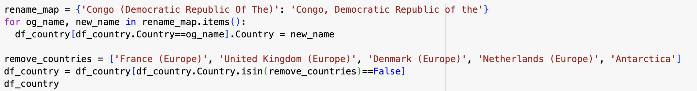
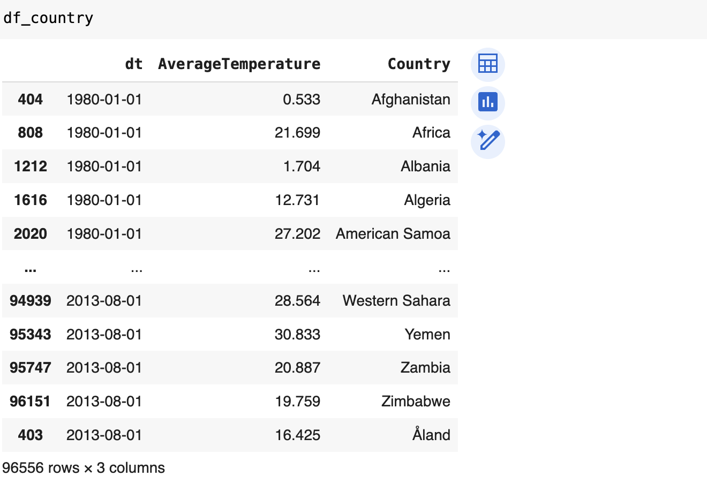
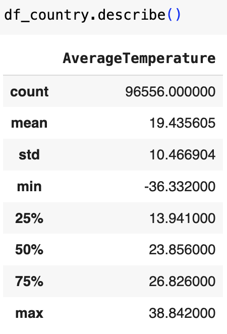
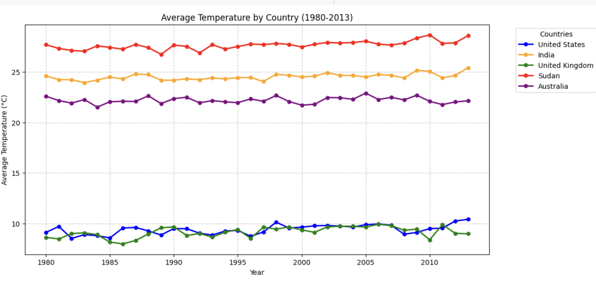
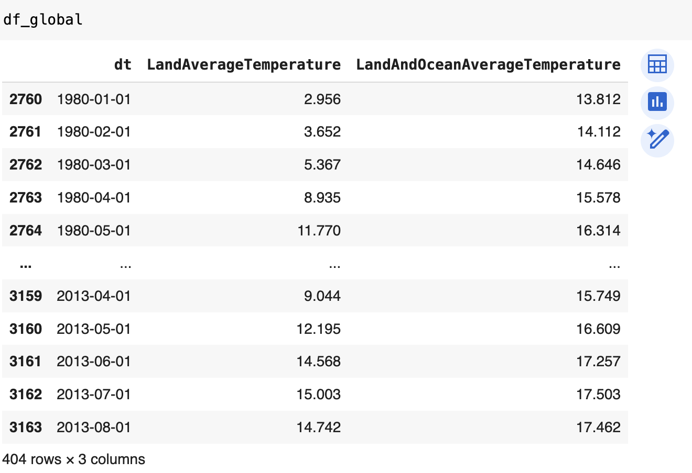
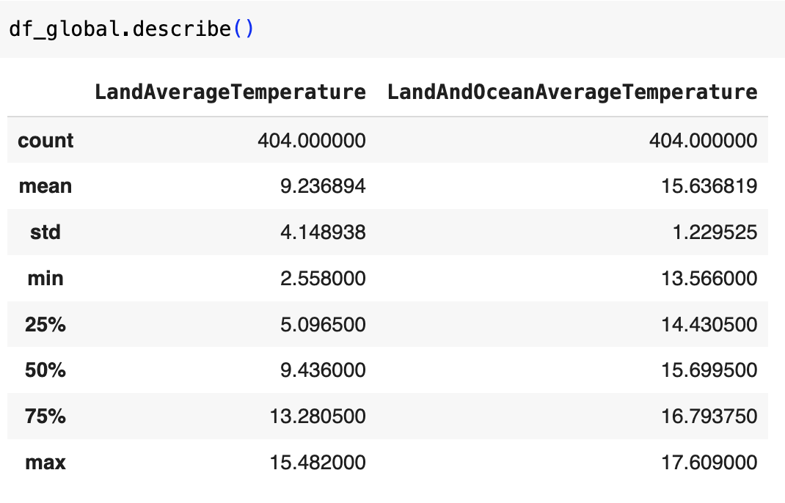
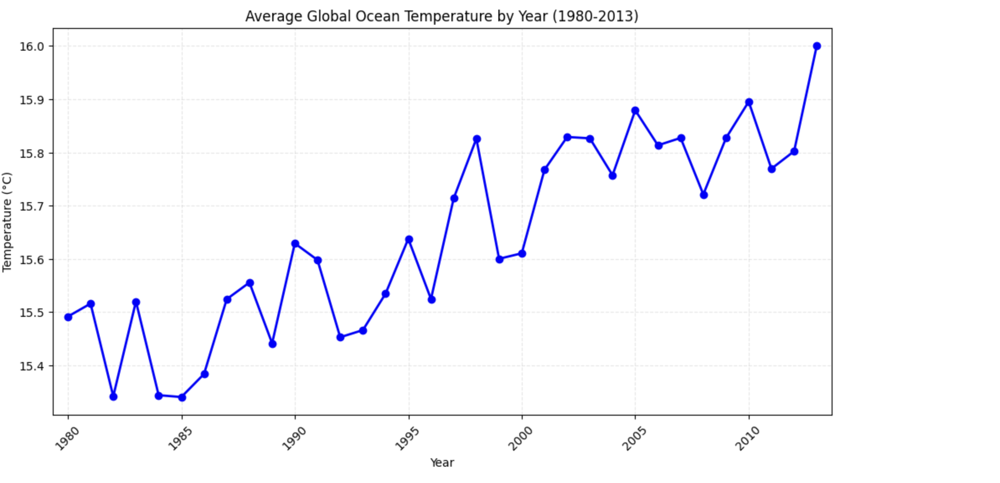
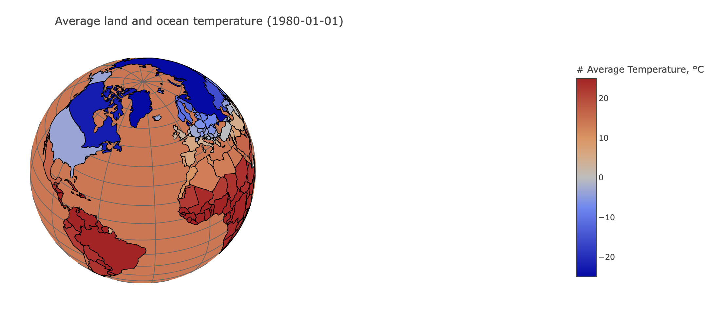
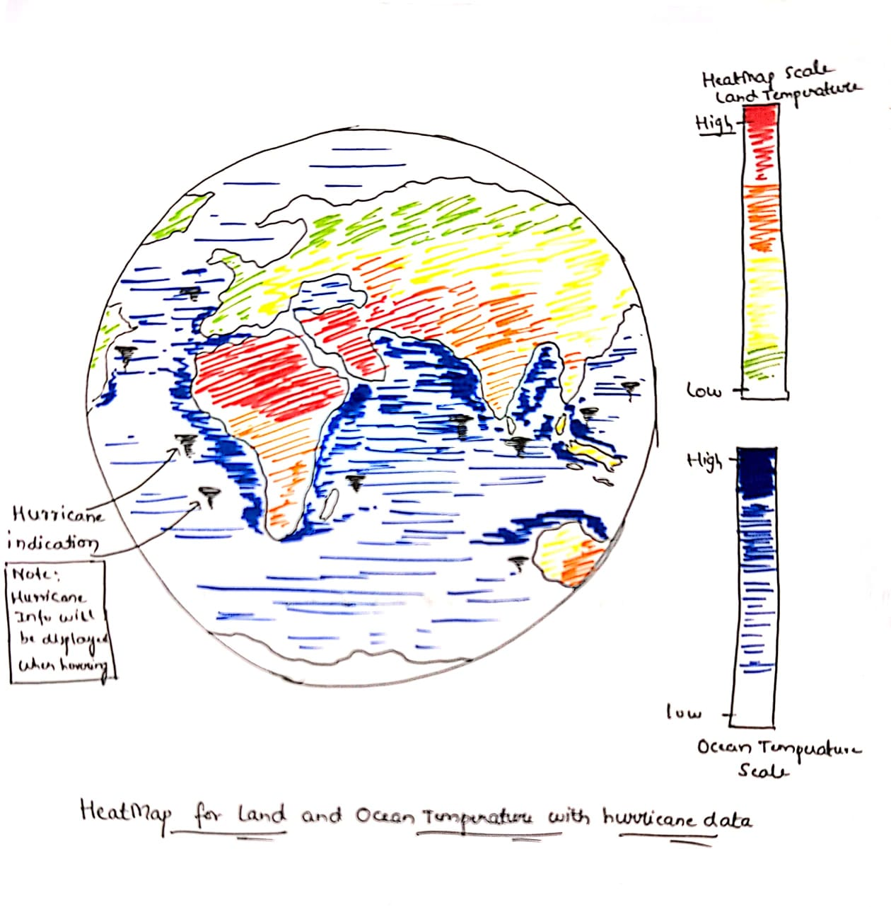

# Final Project Proposal

**GitHub Repo URL**: [final-project-f24-indusinnovators](https://github.com/CMU-IDS-Fall-2024/final-project-f24-indusinnovators/)

## Data Science Question
**How is climate change shaping the intensity and frequency of hurricanes, and what emerging insights can we uncover about future hurricane patterns?**

In this question, we explore the growing influence of climate change on the dynamics of hurricanes. Specifically, how can we analyze the impact of rising surface temperatures on the severity and frequency of these storms? Ultimately, this data science project hopes to provide insights that help guide policymakers on strategies that can save lives, reduce economic losses, and foster greater sustainability commitments towards the future.

## Data Description
**Hurricane Dataset:**  
We make use of the [**IbTrACS**](https://www.ncei.noaa.gov/products/international-best-track-archive) database for this project. This is a global dataset of hurricanes, tropical storms, and cyclones; in particular, we focus on storms recorded after 1980. The dataset has dozens of columns to accommodate differences in recording across countries; some relevant fields we consider are the subbasin the storm formed in, the time of recording, latitude and longitude of the storm, wind speed and pressure, and hurricane category.

We will augment this dataset with global temperature data  from: [**Global Temperatures Dataset**](https://www.kaggle.com/datasets/berkeleyearth/climate-change-earth-surface-temperature-data/data), a compilation of average temperatures across a country seen every day since 1750. It has been put together by the **Berkeley Earth**, which is affiliated with Lawrence Berkeley National Laboratory. It presents temperatures across various granularities like countries, cities, states and longitude and latitude. 

## Project Solution
We plan to create a global visualization illustrating how rising temperatures across different regions correlate with the increasing frequency and intensity of hurricanes. Additionally, we will conduct predictive analyses to forecast various hurricane characteristics based on rising temperatures in specific locations. This will enable us to anticipate the likelihood and severity of hurricanes under different climate scenarios, providing valuable insights for proactive disaster preparedness.

## FlowChart

# Sketches and Data Analysis

## Data Processing

Do you have to do substantial data cleanup? What quantities do you plan to derive from your data? How will data processing be implemented?  Show some screenshots of your data to demonstrate you have explored it. 

We have two datasets in consideration,hurricane and temperature datasets. Once both are cleaned, we will merge them by year. Below are details for processing the individual datasets.

### Data Processing for Hurricane Dataset
##### Do you have to do substantial data cleanup? 
The database is well maintaned so there is no need to perform extensive data cleaning. However, there are some considerations to ensure we have a coherent dataset:
- Filtering track_type of data: There multiple types of tracking data, such as 'main' and 'provisional'. A storm may have more than one set of tracking data applied to it. 'main' is the most consistent and up-to-date type of tracking data, so we can manage this by dropping all other types of data. This decreases the total amount of data available by 3.5%.
- Managing column size: There are 174 columns in this database. Most columns are reports on storm category, maxmimum wind and pressure from different WMO agencies. To manage this, we can do the following:
  - WMO Agency: There is a set of columns [WMO_WIND,WMO_PRES,WMO_AGENCY] that list the measurements that come from the WMO agency resposnsible for tracking that storm (based on its geographic location). These measurements correspond with the measurements from the separate set of columns that correspond to that agency, ex. [BOM_WIND,BMO_PRES] for the BOM WMO. Thus, we only need to retain the WMO_* columns. Since each WMO_Agency calculates wind speeds different, we keep WMO_AGENCY so we can apply the right scaling.
  - Severity/Category of hurricane: Similar to the wind pressure and speed, each WMO agency has its own type of hurricane category and scale system. If we wish to compare results across the globe, we need a single type of scale. We have elected for the USA SSHS system since that is the most consistent across the database. However, not all storms, especially more so in earlier years, do not have a USA SSHS score. In this case, we may need to discsus more elegant solutions to include other WMO scales.
- With this, we have reduced the dataset to a much more manageable set. We can perform cleaning on some columns, such as restricting the season/year from 1980-2024, and replacing all the ' ' in the datasets with pd.NA.
  
##### What quantitites do you plan to derive from your data?
We will mostly focus on deriving maximum wind speed and pressure. From an initial inspection of the dataset, it seems that we may need to standardize measurements, as different WMO agencies will record this speeds in different units. The other feature we plan to extract is the category/severity of the hurricane. In most cases, this should be provided by the USA SSHS, but we will need to consider what to do in cases where it is not available.

##### How will data processing be implemented?
We have set up a skeleton for data processing [here](https://colab.research.google.com/drive/1ReqCUN6d5bqcvO3Fnh4P9Wrdh_HxDgtE?usp=sharing). As we decide on a standardized format for wind,pressure, and category, we will add these as columns to the dataset.

##### Screenshots of data exploration

### Data Processing for Temperature data
> Do you have to do substantial data cleanup?
Extensive data cleaning isn't required as the dataset is partyl processed before being uploaded to Kaggle. However, the following steps are still required:
- Limiting data to 1980-01 to 2013-08
- renaming and removing redundant countries:
  - 
  - We also replicate data from Sudan for South Sudan because the two are very close geographically this mehtod is simplistic and more logical than imputing average as per geo-coordinates of all the countries.

> What quantities do you plan to derive from your data?
- We derive the monthly temperature data for all (most) countries across the globe from 1980 to 2013
- We also derive the monthly global avg temperature for the global ocean across the globe from 1980 to 2013

> How will data processing be implemented?
Data processing has been implemented using **Pandas** in [EDA_Global_Temp_Data Python Notebook](EDA_Global_Temp_Data/EDAGlobalTemperature.ipynb)

> Show some screenshots of your data to demonstrate you have explored it.

## System Design

### Sketch 1 : Yearly Variations of Global Temperature & Hurricane Occurances

The motivation for using this combined bar and line chart is to visually analyze the impact of global warming on both land and ocean temperatures over time, alongside changes in the frequency of hurricanes. This visualization makes it easier to detect trends, compare fluctuations in temperature with hurricane occurrences, and assess how shifts in global climate may influence extreme changes in hurricanes over the years.

### Sketch 2 : Hurricane Severity vs Yearly Changes

This plot visually illustrates how hurricane severity has fluctuated over the years, providing an intuitive way to observe trends and patterns in hurricane intensity. Each circle on the chart represents a specific severity level for a given year, with the radius of each circle corresponding to the number of hurricanes at that level of intensity. By presenting the data this way, the plot highlights variations in hurricane severity over time, offering insights into whether extreme hurricanes are becoming more frequent, or if certain severity levels are occurring more consistently.

### Sketch 3 :

### Sketch 4:

