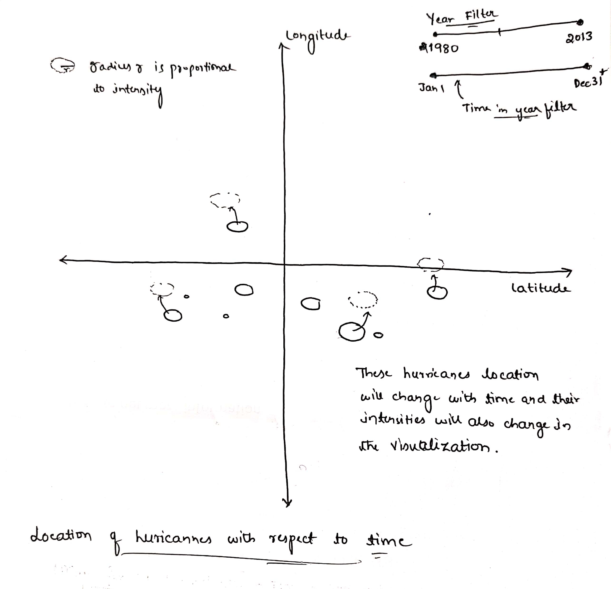

# Final Project Proposal

**GitHub Repo URL**: [final-project-f24-indusinnovators](https://github.com/CMU-IDS-Fall-2024/final-project-f24-indusinnovators/)

## Data Science Question
**How is climate change shaping the intensity and frequency of hurricanes, and what emerging insights can we uncover about future hurricane patterns?**

In this question, we explore the growing influence of climate change on the dynamics of hurricanes. Specifically, how can we analyze the impact of rising surface temperatures on the severity and frequency of these storms? Ultimately, this data science project hopes to provide insights that help guide policymakers on strategies that can save lives, reduce economic losses, and foster greater sustainability commitments towards the future.

## Data Description
**Hurricane Dataset:**  
We make use of the [**IbTrACS**](https://www.ncei.noaa.gov/products/international-best-track-archive) database for this project. This is a global dataset of hurricanes, tropical storms, and cyclones; in particular, we focus on storms recorded after 1980. The dataset has dozens of columns to accommodate differences in recording across countries; some relevant fields we consider are the subbasin the storm formed in, the time of recording, latitude and longitude of the storm, wind speed and pressure, and hurricane category.

We will augment this dataset with global temperature data  from: [**Global Temperatures Dataset**](https://www.kaggle.com/datasets/berkeleyearth/climate-change-earth-surface-temperature-data/data), a compilation of average temperatures across a country seen every day since 1750. It has been put together by the **Berkeley Earth**, which is affiliated with Lawrence Berkeley National Laboratory. It presents temperatures across various granularities like countries, cities, states and longitude and latitude. 

## Project Solution
We plan to create a global visualization illustrating how rising temperatures across different regions correlate with the increasing frequency and intensity of hurricanes. Additionally, we will conduct predictive analyses to forecast various hurricane characteristics based on rising temperatures in specific locations. This will enable us to anticipate the likelihood and severity of hurricanes under different climate scenarios, providing valuable insights for proactive disaster preparedness.

## FlowChart

# Sketches and Data Analysis

## Data Processing

Do you have to do substantial data cleanup? What quantities do you plan to derive from your data? How will data processing be implemented?  Show some screenshots of your data to demonstrate you have explored it. [Kavya, Shrey]

### Data Processing for Temperature data
> Do you have to do substantial data cleanup?
Extensive data cleaning isn't required as the dataset is partyl processed before being uploaded to Kaggle. However, the following steps are still required:
- Limiting data to 1980-01 to 2013-08
- renaming and removing redundant countries:
  - 
  - We also replicate data from Sudan for South Sudan because the two are very close geographically this mehtod is simplistic and more logical than imputing average as per geo-coordinates of all the countries.

> What quantities do you plan to derive from your data?
- We derive the monthly temperature data for all (most) countries across the globe from 1980 to 2013
- We also derive the monthly global avg temperature for the global ocean across the globe from 1980 to 2013

> How will data processing be implemented?
Data processing has been implemented using **Pandas** in [EDA_Global_Temp_Data Python Notebook](EDA_Global_Temp_Data/EDAGlobalTemperature.ipynb)

> Show some screenshots of your data to demonstrate you have explored it.

## System Design

### Sketch 1 : Yearly Variations of Global Temperature & Hurricane Occurances

The motivation for using this combined bar and line chart is to visually analyze the impact of global warming on both land and ocean temperatures over time, alongside changes in the frequency of hurricanes. This visualization makes it easier to detect trends, compare fluctuations in temperature with hurricane occurrences, and assess how shifts in global climate may influence extreme changes in hurricanes over the years.

### Sketch 2 : Hurricane Severity vs Yearly Changes

This plot visually illustrates how hurricane severity has fluctuated over the years, providing an intuitive way to observe trends and patterns in hurricane intensity. Each circle on the chart represents a specific severity level for a given year, with the radius of each circle corresponding to the number of hurricanes at that level of intensity. By presenting the data this way, the plot highlights variations in hurricane severity over time, offering insights into whether extreme hurricanes are becoming more frequent, or if certain severity levels are occurring more consistently.

### Sketch 3 :

### Sketch 4:

