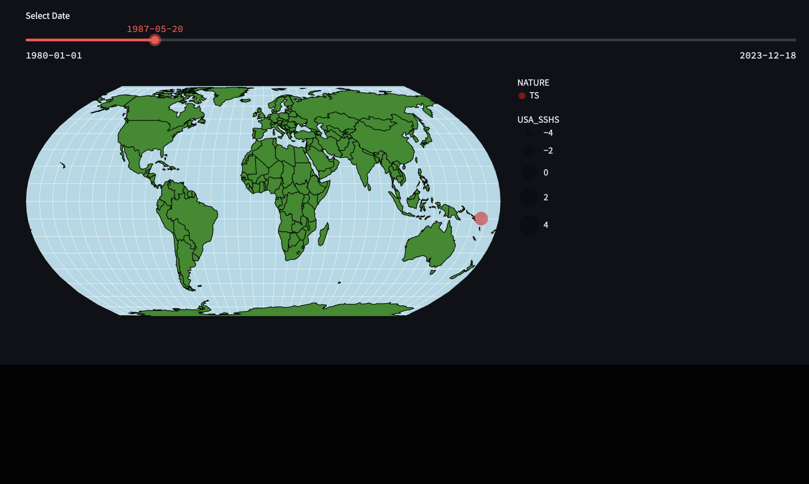

# CMU Interactive Data Science Final Project : Global Temperatures and Their Impact on Hurricanes and Storms

* **Team members**:
  * Gunavardhan Akiti: gakiti@andrew.cmu.edu (contact person)
  * Yashwanth Surendra: yashwany@andrew.cmu.edu
  * Shrey Jain: shreyj@andrew.cmu.edu
  * Kaavya Subramanian: kaavyas@andrew.cmu.edu
 
 ## Abstract
 Update.

## Streamlit App
Update.

 ## Video Link 
 Update.

## Work distribution and project process
Generally, we directly collaborated on overall plans and ideas, and split up executables to work on independently. 
- Project proposal: We all worked together to brainstorm ideas and locate datasets, and then discusssed and wrote our proposal together.
- Sketches and Data Analysis: We all discussed ideas for data analysis and visualization, and after deciding on the final outputs, we split up the data cleaning process, with two people each working on a dataset. We also each took point on a visualization to develop, which we later built into a dashboard page.
- Code development: As discussed before, we each built a separate page of the dashboard. Part of the team took point on building a predictive model for the data science project, and the others supplemented the development process in other ways. 
- Writeup and Video: We each wrote different parts of the report and the video, and collectively reviewed the final product(s).

## Running the software
1. Clone the git respository locally and navigate into the directory: `cd final-project-f24-indusinnovators`
2. Install git-lfs with `git lfs install` and then pull the larger files from the remote repository with `git lfs pull`
3. Run `pip install -r requirements.txt` or `python -m pip install -r requirements.txt` to import all necessary packages and versions.
4. Navigate to the code/ directory: `cd code`
5. Run the homepage file using streamlit, which provides access to all other pages: `streamlit run HomePage.py `

## Deliverables

### Proposal

- [x] A completed [proposal](Proposal.md). Each student should submit the URL that points to this file in their github repo on Canvas.

### Sketches

- [X] Develop sketches/prototype of your project.

### Final deliverables

- [ ] All code for the project should be in the repo.
- [ ] Update the **Online URL** above to point to your deployed project.
- [ ] A detailed [project report](Report.md).  Each student should submit the URL that points to this file in their github repo on Canvas.
- [ ] A 5 minute video demonstration.  Upload the video to this github repo and link to it from your report.
