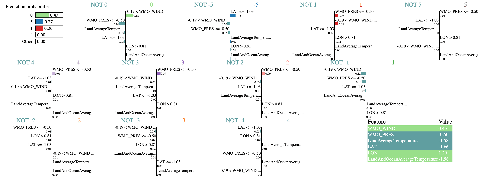

# Final Project Report

**Project URL**: TODO
**Video URL**: TODO

The world is getting warmer every day, and so is the debate over whether the human race should be concerned about it. With many extreme weather events in recent times affecting millions, we seek to discover evidence of this phenomenon being caused by global warming. To this resolve, we first visualize evidence by combining two datasets that recorded every extreme weather event between 1980 and 2013 and the daily global temperatures. We first contrast the yearly hurricane count during these years with the average land and ocean temperatures. While that doesn't give an apparent correlation, we also visualize the path of these hurricanes on a 2D globe and get glimpses of how they get more severe across the years. This led us to visualize the hurricane counts across different severity levels and give a better indication of a rise in the number of category 4 and 5 hurricanes and a trend spanning multiple years. Finally, to bring it all together, we see the effects of these events on land by tracing their path across different months and years. With this evidence, we developed a prediction model for global temperature and the expected hurricane severity at the user's input location and date. A Support Vector Regression model is used for predicting the temperature and Random Forest model is used to predict the hurricane intensity with an accuracy of 92% on held out test data.

## Introduction
Our planet is heating up at an alarming pace, evidenced by 2023 being the hottest year yet on record [[1](https://climate.copernicus.eu/global-climate-highlights-2023)]. This is primarily caused by human activities that involve burning fossil fuels, leading to greenhouse gas emissions that trap more heat from the sun. Studies [[2](https://science.nasa.gov/climate-change/extreme-weather/)] have demonstrated that extreme weather events, such as heat waves, floods, droughts, etc., are becoming more frequent and extreme due to climate change, with one study [[3](https://interactive.carbonbrief.org/attribution-studies/index.html)] showing a 74% correlation. Aggravating this problem is world leaders not acknowledging the problem and its gravity [[4](https://www.latimes.com/opinion/story/2024-12-02/climate-change-united-states-cop29-trump)]. This primarily stems from misinterpretation or lack of evidence and projections that prove the effects of global warming and how it can and is already wreaking havoc on human civilization. With reports [[5](https://www.rms.com/catastrophe-modeling-report-2023)] estimating losses to the tune of $100 billion and almost 100 million lives affected, education on the subject and its solution are need of the hour.

To generate meaningful insights, we focus on one of the extreme events, hurricanes, and demonstrate how the rising temperatures have made them more common and extreme. We provide evidence through interactive visualization and a predictive dashboard highlighting how worse the trend could be!

## Related Work
There have been multiple efforts in this direction:
- A NASA study [[1](https://science.nasa.gov/earth/climate-change/a-force-of-nature-hurricanes-in-a-changing-climate/)] understands the fluid dynamics to understand how a hurricane affects and is affected by temperature, and hence, presents conclusively that climate change is indeed making the proportion of categories 4 and 5 higher.
- Another study by NASA [[2](https://science.nasa.gov/climate-change/extreme-weather/)] looks at better attributing extreme weather events to climate change. The study demonstrates that global warming worsens the flooding and makes the storm more likely to occur. This helps understand how climate change exacerbates the impacts of such extreme events, providing insights into the correlation between global warming and extreme weather.
- Further, Woodwell Climate Research Center's efforts [[3](https://www.woodwellclimate.org/how-climate-change-is-affecting-hurricanes/)] also try to capture the impact of climate change on hurricanes. It elaborated on how human-caused global warming has aggravated hurricane extreme hourly rainfall rates by 11%. This leads to more destruction when hurricanes make landfall. It also highlights that rising sea levels from global warming intensify storm surges and flooding during hurricanes.

## Methods

## Methodology

This section describes the visualization techniques, modeling approaches, and model diagnostics employed in the project. The methodology is organized into three primary parts: Visualization, Modeling, and Model Agnostics.

### a) Visualizations
There are mainly 4 different visualizations that tell a story of how temperature affects hurricane counts, intensity and the path it follows. On the Hurricane Count Page, we use bar charts to display yearly hurricane counts and line graphs to show trends in land and land-ocean temperatures, incorporating interactive legends and filtering controls for custom exploration. The Storm Life Cycle Page visualizes storm paths and intensities on a global map, combining geospatial data with storm characteristics such as latitude, longitude, and severity (USA_SSHS). The Severity Levels Page uses Altair to categorize hurricane severity trends, representing yearly counts by intensity levels with circle sizes for frequency and colors for severity, allowing filtering by year or month. Finally, the Regional Storm Map integrates choropleth mapping for land temperatures and scattergeo plots for hurricane paths, filtered dynamically by year, month, and basin. The visualization also calculates metrics like storm frequency and elapsed time since onset and uses an Altair area chart to depict intensity trends across selected basins, enabling region-specific analysis.

### b) Modelling
We have experimented with 3 models to study the dynamics of temperature and hurricanes - the first one was used to predict temperature, second was used hurricane intensity and the last one was used to estimate its characteristics. Let’s go through each of them in detail.

- **i) Temperature Prediction Model**: Support Vector Regression (SVR) model was used to predict global Land and Ocean Average Temperature using daily temperature records from 1980 to 2013. The features included Year, Month, and Day, while the target variable was LandAndOceanAverageTemperature. Missing values were removed, and the data was split into training and testing sets in an 80-20 ratio. We used an rbf kernel to capture non-linear relationships, with hyperparameters C=100 for regularization and gamma=0.1 to control the influence of data points in the feature space. The model achieved a Mean Absolute Error (MAE) of 0.094 and a Root Mean Squared Error (RMSE) of 0.123, which means we are effectively able to model global temperature trends and provide reliable predictions of climate patterns as shown on test data in figure 1.

  
   
  <em>Figure 1: SVR model Predictions on test data.</em>

- **ii) Hurricane Intensity Prediction Model**: Random Forest Classifier was employed to predict the USA_SSHS category of hurricanes, using meteorological and temporal features from a merged dataset. The features included latitude LAT, longitude LON, LandAndOceanAverageTemperature (temperature predictor model output will be used as shown in figure 2), month, day and year. Missing data was handled by removing incomplete records, and the dataset was split into an 80-20 training and testing split. We investigated and found that there was class imbalance(40% of the labels were class 2 intensity hurricanes) and addressed that using SMOTE (Synthetic Minority Oversampling Technique), significantly improving the balance of the training set. The input features were scaled using StandardScaler for uniformity. The model, with its ensemble learning approach, was trained on the resampled data and achieved an accuracy score of 0.908 on the test set. Furthermore, we calculated relaxed accuracy which was 97.9% (±1) which highlights the model’s predictive capability even with minor deviations in true labels.

  
   
  <em>Figure 2: High Level Flow showing how both models are related</em>

- **iii) Hurricane Characteristics Prediction Model**: We created a hybrid model that used LSTM layers for sequential storm data and dense layers for static features to predict hurricane category (USA_SSHS), wind speed, and pressure. It combined time-series features like wind and pressure with static attributes like temperature and location, trained with MinMax scaling and mean squared error. But only less than 10% of the reading recording for each hurricane had the characteristics such as wind speed and pressure. So, in other words the dataset was too sparse and the model ended up overfitting and led to poor generalization as shown from the figure 3. Therefore, it is used in the final implementation.

  
   
  <em>Figure 3: LSTM time series prediction on entire data</em>

### c) Model Agnostics
Since there are only two possible features(date, position) for the first model to predict the temperature, we did not perform model agnostics as it is understood that both are necessary features. For hurricane intensity model, we started with LAT', 'LON', 'WMO_WIND', 'WMO_PRES', 'LandAverageTemperature', 'LandAndOceanAverageTemperature’ as features and experimented with all the classical ML algorithms and random forest gave the best performance in terms of accuracy. We went ahead with random forest to perform model agnostics. First, we chose to plot the feature correlation matrix as shown in the figure 4 and saw that 'LandAverageTemperature' and 'LandAndOceanAverageTemperature’ are highly related (correlation value of 1.0). So, removed the redundant feature 'LandAverageTemperature'. 

  
   
  <em>Figure 4: Feature correlation matrix</em>

Next, we examined the feature importance bar chart as shown in figure 5 to see if there are any features that are not contributing to the target (hurricane intensity). 

  
   
  <em>Figure 5: Feature importance for random forest model</em>

To further understand the predictions of the model and analyze feature importance at the instance level, we performed LIME (Local Interpretable Model-agnostic Explanations) that helps explain the contribution of individual features (e.g., latitude, longitude, wind speed, pressure) to the model's prediction for a specific instance. So, it provided insights into how the features influenced the predicted hurricane intensity, making the model's decision-making process more transparent. For example, the analysis showed that features like wind speed and pressure often had the highest impact on the predictions for severe storms and other contributions for each of the classes is shown in the figure 6. Finally, for the time series LSTM model, we noticed early on that it did not perform well on new inputs due to overfitting and did not continue with any deep analysis, since we already came to the conclusion that the data set was too sparse to train a deep learning model.

  
   
  <em>Figure 6: LIME Analysis of random forest predictions</em>

## Results

## Discussion

## Future Work
